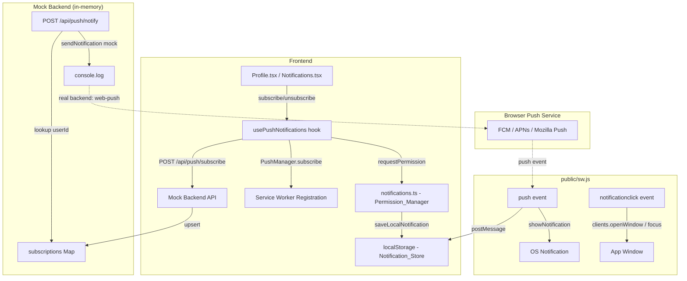

# Design Document: PWA Push-Bildirishnomalar Tizimi

## Overview

MYBRON PWA ilovasi uchun to'liq push-bildirishnomalar tizimi. Tizim uch asosiy qismdan iborat:

1. **Service Worker** (`public/sw.js`) — brauzer background threadida ishlaydi, push eventlarni qabul qiladi va `showNotification()` orqali ko'rsatadi.
2. **Frontend** (`usePushNotifications` hook + mavjud `notifications.ts`) — foydalanuvchidan ruxsat so'raydi, VAPID Public Key yordamida `PushSubscription` hosil qiladi, backendga yuboradi.
3. **Mock Backend** (in-memory store + API handlers) — subscriptionlarni saqlaydi, bron holati o'zgarganda push xabar yuboradi (mock rejimida `console.log`).

Loyiha React + Vite + TypeScript, Vercel deploy. Backend hali mock rejimida — real Supabase backend tayyor bo'lganda faqat API layer almashtiriladi.

---

## Architecture



**Ma'lumot oqimi:**
1. Foydalanuvchi "Yoqish" tugmasini bosadi → `usePushNotifications.subscribe()` chaqiriladi
2. `Notification.requestPermission()` → brauzer dialog ko'rsatadi
3. Ruxsat berilsa → `pushManager.subscribe({ userVisibleOnly: true, applicationServerKey })` → `PushSubscription`
4. Subscription JSON → `POST /api/push/subscribe` (mock: in-memory Map ga saqlaydi)
5. Bron holati o'zgarganda → `POST /api/push/notify` → mock: `console.log`, real: `web-push.sendNotification()`
6. Push service → Service Worker `push` event → `showNotification()` + `saveLocalNotification()`
7. Foydalanuvchi bildirishnomaga bosadi → `notificationclick` → `/bookings` sahifasiga yo'naltiradi

---

## Components and Interfaces

### 1. `usePushNotifications` Hook

```typescript
// src/app/lib/usePushNotifications.ts

export interface PushNotificationState {
  permission: NotificationPermission | 'unsupported';
  isSubscribed: boolean;
  isLoading: boolean;
  subscribe: () => Promise<void>;
  unsubscribe: () => Promise<void>;
}

export function usePushNotifications(): PushNotificationState
```

**Ichki logika:**
- `useEffect` da mavjud subscription holatini tekshiradi (`pushManager.getSubscription()`)
- iOS standalone rejimini aniqlaydi (`window.matchMedia('(display-mode: standalone)')`)
- Xatolarni `try/catch` bilan ushlaydi, `isLoading` ni har doim `false` ga qaytaradi

### 2. VAPID Utility

```typescript
// src/app/lib/vapid.ts

export function urlBase64ToUint8Array(base64String: string): Uint8Array
// base64url → Uint8Array konvertatsiya (iOS Safari uchun zarur)
```

### 3. Mock Backend API Handlers

```typescript
// src/app/lib/mockPushApi.ts

interface StoredSubscription {
  userId: string;
  subscription: PushSubscriptionJSON;
  createdAt: string;
}

// In-memory store
const subscriptions = new Map<string, StoredSubscription[]>();

export async function apiSubscribe(userId: string, subscription: PushSubscriptionJSON): Promise<void>
export async function apiUnsubscribe(userId: string, endpoint: string): Promise<void>
export async function apiSendNotification(userId: string, payload: PushPayload): Promise<void>
```

### 4. Service Worker Push Handlers (mavjud `sw.js` kengaytmasi)

```javascript
// public/sw.js — qo'shiladigan qismlar

self.addEventListener('push', (event) => { ... })
self.addEventListener('notificationclick', (event) => { ... })
```

### 5. `notifications.ts` Kengaytmasi

Mavjud `requestNotificationPermission()` va `saveLocalNotification()` funksiyalari o'zgarishsiz qoladi. Yangi qo'shimcha:

```typescript
export function isPushSupported(): boolean
export function isIOSStandalone(): boolean
```

---

## Data Models

### PushPayload (Service Worker ↔ Backend)

```typescript
interface PushPayload {
  title: string;           // "Bron tasdiqlandi! 🎉"
  body: string;            // "City Sports — 28 Aprel, 18:00"
  icon?: string;           // "/bronlogo.png" (default)
  badge?: string;          // "/bronlogo.png" (default)
  url?: string;            // "/bookings" (notificationclick uchun)
  actions?: NotificationAction[];
  type?: NotifType;        // mavjud NotifType dan
}
```

### StoredSubscription (Mock Backend)

```typescript
interface StoredSubscription {
  userId: string;
  subscription: PushSubscriptionJSON;  // { endpoint, keys: { p256dh, auth } }
  createdAt: string;                   // ISO 8601
}
```

### LocalNotification (mavjud, o'zgarishsiz)

```typescript
// src/app/lib/notifications.ts — mavjud interfeys
interface LocalNotification {
  id: string;
  type: NotifType;
  title: string;
  body: string;
  url?: string;
  createdAt: string;
  read: boolean;
}
```

### Environment Variables

```
# Frontend (.env)
VITE_VAPID_PUBLIC_KEY=<base64url public key>

# Backend (.env — faqat server tomonida)
VAPID_PRIVATE_KEY=<base64url private key>
VAPID_SUBJECT=mailto:admin@mybron.uz
```

### iOS Moslik Matritsasi

| Platforma | Versiya | Push qo'llab-quvvatlash | Shart |
|-----------|---------|------------------------|-------|
| iOS Safari | 16.4+ | ✅ | PWA standalone rejim |
| iOS Safari | < 16.4 | ❌ | — |
| iOS Safari | har qanday | ❌ | Oddiy brauzer rejim |
| Android Chrome | 42+ | ✅ | — |
| Desktop Chrome | 42+ | ✅ | — |
| Firefox | 44+ | ✅ | — |

---

## Correctness Properties

*A property is a characteristic or behavior that should hold true across all valid executions of a system — essentially, a formal statement about what the system should do. Properties serve as the bridge between human-readable specifications and machine-verifiable correctness guarantees.*

### Property 1: Notification Store Round Trip

*For any* valid `LocalNotification` object, saving it via `saveLocalNotification()` and then reading via `getLocalNotifications()` should return a list that contains an equivalent notification object.

**Validates: Requirements 9.1, 9.2**

---

### Property 2: Whitespace-only va bo'sh body rad etiladi

*For any* push payload where `body` is composed entirely of whitespace characters, the system SHALL not display a notification and SHALL not save it to the Notification Store.

**Validates: Requirements 1.2, 8.4**

---

### Property 3: Unread count invarianti

*For any* sequence of `saveLocalNotification()` calls with `read: false`, the value returned by `getUnreadCount()` SHALL equal the number of unread notifications in `getLocalNotifications()`.

**Validates: Requirements 9.1**

---

### Property 4: markAllRead idempotentligi

*For any* notification store state, calling `markAllRead()` once or multiple times SHALL produce the same result — all notifications have `read: true` and `getUnreadCount()` returns 0.

**Validates: Requirements 9.3**

---

### Property 5: Subscription upsert — dublikat yo'q

*For any* userId and PushSubscription endpoint, calling `apiSubscribe()` multiple times with the same endpoint SHALL result in exactly one stored subscription for that endpoint (no duplicates).

**Validates: Requirements 5.4**

---

### Property 6: Unsubscribe keyin subscription yo'q

*For any* userId that has an active subscription, calling `apiUnsubscribe()` with that subscription's endpoint SHALL result in the subscription no longer being present in the store.

**Validates: Requirements 5.3, 4.3**

---

### Property 7: urlBase64ToUint8Array round trip

*For any* valid base64url-encoded VAPID public key string, converting via `urlBase64ToUint8Array()` and then back to base64url SHALL produce an equivalent string (same bytes).

**Validates: Requirements 2.4, 7.2**

---

### Property 8: Push payload default qiymatlar

*For any* push event where the payload is missing optional fields (`icon`, `badge`, `url`), the Service Worker SHALL use default values (`/bronlogo.png`, `/bronlogo.png`, `/`) and SHALL NOT throw an error.

**Validates: Requirements 1.2, 1.5**

---

## Error Handling

| Xato holati | Qayta ishlash | Foydalanuvchiga ko'rsatish |
|-------------|---------------|---------------------------|
| `Notification` API yo'q | `'unsupported'` qaytaradi | "Brauzeringiz qo'llab-quvvatlamaydi" |
| `permission === 'denied'` | `requestPermission()` chaqirilmaydi | "Brauzer sozlamalaridan ruxsat bering" |
| `PushManager.subscribe()` xato | `isLoading = false`, xato loglanadi | Tushunarli xato xabari |
| Backend API muvaffaqiyatsiz | Xato loglanadi, UI bloklanmaydi | Subscription lokal saqlanadi |
| SW ro'yxatdan o'tish xato | `console.error`, asosiy funksional ta'sirlanmaydi | — |
| `410 Gone` push xatosi | Subscription o'chiriladi | — |
| iOS standalone emas | Subscribe urinilmaydi | "Ilovani o'rnatib yoqing" ko'rsatmasi |
| JSON parse xato (SW) | Default payload ishlatiladi | — |

---

## Testing Strategy

### Unit Tests (Vitest)

Quyidagi funksiyalar uchun aniq misollar va edge case lar:

- `urlBase64ToUint8Array()` — to'g'ri konvertatsiya, noto'g'ri input
- `saveLocalNotification()` / `getLocalNotifications()` — CRUD operatsiyalar
- `getUnreadCount()` — turli holatlarda to'g'ri hisob
- `markAllRead()` — idempotentlik
- `isPushSupported()` / `isIOSStandalone()` — brauzer environment mock
- `apiSubscribe()` / `apiUnsubscribe()` — upsert va o'chirish logikasi

### Property-Based Tests (fast-check)

**Kutubxona:** [`fast-check`](https://github.com/dubzzz/fast-check) — TypeScript uchun eng keng tarqalgan PBT kutubxonasi.

**Konfiguratsiya:** Har bir property test minimum **100 iteratsiya** bilan ishga tushiriladi.

**Tag formati:** `// Feature: pwa-push-notifications, Property N: <property_text>`

| Property | Test | fast-check generator |
|----------|------|---------------------|
| P1: Notification Store Round Trip | `fc.record({ id, type, title, body, ... })` generatsiya, save → read, tekshirish | `fc.record` |
| P3: Unread count invarianti | N ta `read: false` notification save, `getUnreadCount() === N` | `fc.array(fc.record(...))` |
| P4: markAllRead idempotentligi | Ixtiyoriy store, `markAllRead()` 1-2 marta, `getUnreadCount() === 0` | `fc.array(...)` |
| P5: Subscription upsert | Bir xil endpoint bilan N marta `apiSubscribe()`, natijada 1 ta yozuv | `fc.string()` userId, `fc.string()` endpoint |
| P6: Unsubscribe keyin yo'q | Subscribe → unsubscribe, endpoint topilmaydi | `fc.string()` |
| P7: urlBase64ToUint8Array round trip | Ixtiyoriy base64url string, konvertatsiya → qayta base64url | `fc.base64String()` |
| P8: Push payload defaults | Ixtiyoriy to'liqsiz payload, default qiymatlar to'g'ri | `fc.record` partial |

### Integration Tests

- Service Worker `push` event → `showNotification()` chaqirilganligini tekshirish (SW mock)
- `notificationclick` → to'g'ri URL ga yo'naltirish
- iOS standalone detection logikasi

### Smoke Tests

- `VITE_VAPID_PUBLIC_KEY` environment variable mavjudligi
- Service Worker ro'yxatdan o'tishi muvaffaqiyatli
- `manifest.json` da `display: "standalone"` mavjudligi
